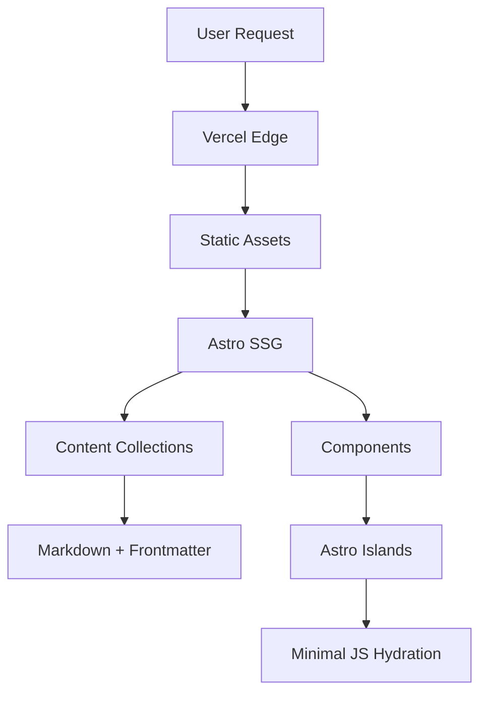

# 🔐 Crypt0xDev

<div align="center">


**Un blog moderno bilingüe especializado en ciberseguridad, writeups de CTF y contenido técnico**

[🌐 Ver Demo](https://crypt0xdev.vercel.app) • [📖 Documentación](#-documentación) • [🚀 Inicio Rápido](#-inicio-rápido)

</div>

---

## 🎯 Descripción del Proyecto

**Crypt0xDev** es una plataforma web moderna desarrollada con **Astro v5** que combina un blog técnico con una colección organizada de writeups de CTF. El sitio está completamente optimizado para rendimiento y SEO, con soporte bilingüe nativo (Español/Inglés) y una arquitectura escalable basada en Content Collections.

## ✨ Características Principales

<table>
  <tr>
    <td>🌍</td>
    <td><strong>Internacionalización</strong></td>
    <td>Soporte nativo bilingüe (ES/EN) con rutas localizadas</td>
  </tr>
  <tr>
    <td>🔐</td>
    <td><strong>Writeups Especializados</strong></td>
    <td>CTF organizados por plataforma (HTB, THM, VulnHub, etc.)</td>
  </tr>
  <tr>
    <td>⚡</td>
    <td><strong>Rendimiento Óptimo</strong></td>
    <td>SSG + hidratación selectiva, Lighthouse Score 100</td>
  </tr>
  <tr>
    <td>📚</td>
    <td><strong>Content Collections</strong></td>
    <td>Sistema tipado para contenido con esquemas Zod</td>
  </tr>
  <tr>
    <td>🎨</td>
    <td><strong>UI Moderna</strong></td>
    <td>Tailwind CSS + diseño responsive cyberpunk</td>
  </tr>
  <tr>
    <td>🔍</td>
    <td><strong>SEO Avanzado</strong></td>
    <td>Sitemap multiidioma + meta tags optimizados</td>
  </tr>
  <tr>
    <td>🖼️</td>
    <td><strong>Hero Images</strong></td>
    <td>Imágenes de portada en posts/writeups con lazy loading</td>
  </tr>
  <tr>
    <td>🔗</td>
    <td><strong>Posts Relacionados</strong></td>
    <td>Recomendaciones inteligentes basadas en tags y plataforma</td>
  </tr>
  <tr>
    <td>📑</td>
    <td><strong>Table of Contents</strong></td>
    <td>TOC automático con navegación y resaltado activo</td>
  </tr>
  <tr>
    <td>🏷️</td>
    <td><strong>Filtrado por Tags</strong></td>
    <td>Sistema de filtrado interactivo con URLs amigables</td>
  </tr>
  <tr>
    <td>🚀</td>
    <td><strong>CI/CD Automatizado</strong></td>
    <td>Deploy continuo con GitHub Actions + Vercel</td>
  </tr>
  <tr>
    <td>🛠️</td>
    <td><strong>DX Optimizada</strong></td>
    <td>TypeScript + ESLint + Prettier + VS Code configurado</td>
  </tr>
</table>

## 🏗️ Arquitectura del Proyecto

### 🏗️ Estructura de Directorios

Basada en las [mejores prácticas oficiales de Astro](https://docs.astro.build/en/basics/project-structure/) con extensiones para internacionalización:

```text
/
├── public/                               # Assets estáticos (no procesados)
│   ├── robots.txt                        # SEO crawler configuration
│   └── images/                           # Imágenes optimizadas por categoría
│       ├── about/                        # Assets página personal
│       ├── blog/                         # Imágenes para artículos
│       └── writeups/                     # Screenshots y diagramas CTF
├── src/                                  # Código fuente principal
│   ├── assets/                           # Assets procesados por Vite
│   │   ├── scripts/                      # Scripts con bundling automático
│   │   └── styles/                       # Arquitectura CSS modular
│   │       ├── components/               # Estilos por componente (BEM)
│   │       │   ├── buttons.css           # Sistema de botones unificado
│   │       │   ├── footer.css            # Footer responsive
│   │       │   └── header.css            # Header con navegación
│   │       ├── pages/                    # Estilos específicos por ruta
│   │       │   └── index.css             # Landing page styles
│   │       ├── global.css                # Estilos globales + Tailwind base
│   │       ├── reset.css                 # Normalize.css personalizado
│   │       └── variables.css             # Design tokens CSS customizados
│   ├── components/                       # Componentes Astro tipados
│   │   ├── ui/                           # Design System base
│   │   │   ├── Header.astro              # Header + navegación responsive
│   │   │   ├── Footer.astro              # Footer con enlaces sociales
│   │   │   ├── LanguageSelector.astro    # Toggle bilingüe con persistencia
│   │   │   └── Navigation.astro          # Nav principal con indicadores activos
│   │   ├── blog/                         # Componentes del blog
│   │   │   ├── PostCard.astro            # Card con metadatos + reading time
│   │   │   ├── PostList.astro            # Lista con paginación integrada
│   │   │   └── TagFilter.astro           # Filtrado por taxonomías
│   │   └── writeup/                      # Componentes CTF especializados
│   │       ├── WriteupCard.astro         # Card con difficulty + platform
│   │       ├── WriteupList.astro         # Grid organizado por plataforma
│   │       ├── DifficultyBadge.astro     # Badge color-coded por nivel
│   │       └── PlatformBadge.astro       # Badge con logos de plataformas
│   ├── layouts/                          # Sistema de layouts jerárquico
│   │   ├── Layout.astro                  # Base layout con SEO + i18n
│   │   ├── BlogLayout.astro              # Layout con TOC + navegación
│   │   ├── WriteupLayout.astro           # Layout técnico con metadatos
│   │   └── PageLayout.astro              # Layout simple para páginas estáticas
│   ├── pages/                            # File-based routing (Astro)
│   │   ├── index.astro                   # Root: redirección inteligente por idioma
│   │   ├── [lang]/                       # Rutas dinámicas localizadas
│   │   │   ├── index.astro               # Landing page por idioma
│   │   │   ├── about/                    # Información personal
│   │   │   │   └── index.astro           # Bio + skills + contacto
│   │   │   ├── blog/                     # Blog técnico
│   │   │   │   ├── index.astro           # Lista con filtros + paginación
│   │   │   │   └── [slug].astro          # Post individual + navegación
│   │   │   └── writeup/                  # Sección CTF especializada
│   │   │       ├── index.astro           # Dashboard con stats + últimos
│   │   │       ├── [platform]/           # Organización por plataforma
│   │   │       │   ├── index.astro       # Lista filtrada (HTB, THM, etc.)
│   │   │       │   └── [slug].astro      # Writeup con metadatos técnicos
│   │   │       └── [slug].astro          # Fallback para otras plataformas
│   │   └── api/                          # API routes para funcionalidad avanzada
│   ├── content/                          # Content Collections (type-safe)
│   │   ├── config.ts                     # Esquemas Zod + validación automática
│   │   ├── blog/                         # Articles con frontmatter tipado
│   │   │   ├── es/                       # Contenido localizado español
│   │   │   │   └── post-1.md             # Artículo con metadatos completos
│   │   │   └── en/                       # Contenido localizado inglés
│   │   │       └── post-1.md             # Traducción sincronizada
│   │   └── writeups/                     # CTF writeups especializados
│   │       ├── es/                       # Writeups en español
│   │       │   ├── htb/                  # HackTheBox challenges
│   │       │   │   └── ejemplo.md        # Template con metadatos técnicos
│   │       │   └── tryhackme/            # TryHackMe rooms
│   │       └── en/                       # Writeups en inglés
│   │           ├── htb/                  # HackTheBox challenges
│   │           │   └── sample.md         # Estructura estandarizada
│   │           └── tryhackme/            # TryHackMe rooms
│   ├── i18n/                             # Sistema i18n robusto
│   │   ├── index.ts                      # Configuración principal + tipos TS
│   │   ├── es.json                       # Diccionario español (UI strings)
│   │   └── en.json                       # Diccionario inglés (UI strings)
│   └── utils/                            # Utilities & helpers tipados
│       ├── i18n.ts                       # Funciones de localización
│       ├── content.ts                    # Helpers para Content Collections
│       └── date.ts                       # Formateo de fechas localizado
├── .gitignore                            # Exclusiones Git optimizadas
├── astro.config.mjs                      # Configuración principal Astro
├── package.json                          # Dependencies + scripts
├── tsconfig.json                         # TypeScript configuration
├── LICENSE                               # MIT License
└── README.md                             # Esta documentación
```

To learn more about the folder structure of an Astro project, refer to [our guide on project structure](https://docs.astro.build/en/basics/project-structure/).

## 🚀 Inicio Rápido

### 📋 Prerrequisitos del Sistema

```bash
# Versiones requeridas
Node.js >= 18.20.8 (LTS recomendado)
pnpm >= 7.1.0 (gestor preferido)
Git >= 2.25.0

# Verificar instalación
node --version && pnpm --version && git --version
```

### 🔧 Configuración del Entorno

```bash
# 1. Clonar repositorio
git clone https://github.com/tu-usuario/crypt0xdev.git
cd crypt0xdev

# 2. Instalar dependencias (modo desarrollo)
pnpm install

# 3. Configurar VS Code (opcional pero recomendado)
code . # Instala extensiones recomendadas automáticamente

# 4. Iniciar servidor de desarrollo
pnpm dev
```

### 🧞 Scripts de Desarrollo

| Script         | Comando           | Descripción                          | Puerto/Output    |
| -------------- | ----------------- | ------------------------------------ | ---------------- |
| **Desarrollo** | `pnpm dev`        | Servidor con hot reload + tipo check | `localhost:4321` |
| **Build**      | `pnpm build`      | Build optimizado para producción     | `./dist/`        |
| **Preview**    | `pnpm preview`    | Previsualiza build local             | `localhost:4321` |
| **Type Check** | `pnpm type-check` | Verificación TypeScript sin build    | Terminal         |
| **Sync**       | `pnpm prepare`    | Sincroniza Content Collections       | `.astro/`        |

### 🔍 Calidad de Código

| Script           | Comando             | Descripción                   | Configuración      |
| ---------------- | ------------------- | ----------------------------- | ------------------ |
| **Lint**         | `pnpm lint`         | Análisis estático (ESLint)    | `eslint.config.js` |
| **Lint Fix**     | `pnpm lint:fix`     | Auto-corrección ESLint        | -                  |
| **Format**       | `pnpm format`       | Formateo con Prettier         | `.prettierrc`      |
| **Format Check** | `pnpm format:check` | Verificar formato sin cambios | -                  |

### ⚡ Development Workflow

```bash
# Flujo típico de desarrollo
pnpm dev              # 1. Iniciar desarrollo
pnpm type-check       # 2. Verificar tipos
pnpm lint:fix         # 3. Corregir linting
pnpm format           # 4. Formatear código
pnpm build            # 5. Build de prueba
pnpm preview          # 6. Verificar build
```

## 🏗️ Stack Tecnológico

### Core Framework & Runtime

| Tecnología                                        | Versión    | Propósito                                   | Documentación                                    |
| ------------------------------------------------- | ---------- | ------------------------------------------- | ------------------------------------------------ |
| **[Astro](https://astro.build/)**                 | `v5.15.3`  | Meta-framework con Islands Architecture     | [Docs](https://docs.astro.build/)                |
| **[Node.js](https://nodejs.org/)**                | `18.20.8+` | Runtime de JavaScript moderno               | [Docs](https://nodejs.org/docs/)                 |
| **[TypeScript](https://www.typescriptlang.org/)** | `^5.x`     | Tipado estático + DX mejorada               | [Handbook](https://www.typescriptlang.org/docs/) |
| **[Vite](https://vitejs.dev/)**                   | -          | Build tool ultrarrápido (incluido en Astro) | [Guide](https://vitejs.dev/guide/)               |

### Content Management & Markdown

| Tecnología                                                                                 | Versión   | Propósito                               |
| ------------------------------------------------------------------------------------------ | --------- | --------------------------------------- |
| **[Content Collections](https://docs.astro.build/en/guides/content-collections/)**         | Native    | Sistema de contenido tipado con Zod     |
| **[@astrojs/mdx](https://github.com/withastro/astro/tree/main/packages/integrations/mdx)** | `^4.3.9`  | MDX avanzado + componentes en Markdown  |
| **[Zod](https://zod.dev/)**                                                                | -         | Validación de esquemas + type inference |
| **[Shiki](https://shiki.style/)**                                                          | `^3.14.0` | Syntax highlighting preciso             |
| **[reading-time](https://www.npmjs.com/package/reading-time)**                             | `^1.5.0`  | Cálculo automático de tiempo de lectura |

### Styling & UI Framework

| Tecnología                                                                    | Versión   | Propósito                            |
| ----------------------------------------------------------------------------- | --------- | ------------------------------------ |
| **[Tailwind CSS](https://tailwindcss.com/)**                                  | `^3.4.18` | Utility-first CSS framework          |
| **[@tailwindcss/typography](https://tailwindcss.com/docs/typography-plugin)** | `^0.5.19` | Tipografía optimizada para contenido |
| **CSS Modules**                                                               | Native    | Escopado de estilos por componente   |
| **CSS Custom Properties**                                                     | Native    | Design tokens + theming              |

### SEO & Performance

| Tecnología                                                                             | Versión   | Propósito                             |
| -------------------------------------------------------------------------------------- | --------- | ------------------------------------- |
| **[@astrojs/sitemap](https://docs.astro.build/en/guides/integrations-guide/sitemap/)** | `^3.6.0`  | Generación automática de sitemap XML  |
| **[Sharp](https://sharp.pixelplumbing.com/)**                                          | `^0.34.4` | Optimización de imágenes              |
| **Static Generation**                                                                  | Native    | Pre-rendering para performance óptima |

### Deployment & Infrastructure

| Tecnología                                                                           | Versión  | Propósito                      |
| ------------------------------------------------------------------------------------ | -------- | ------------------------------ |
| **[Vercel](https://vercel.com/)**                                                    | -        | Edge deployment + CDN global   |
| **[@astrojs/vercel](https://docs.astro.build/en/guides/integrations-guide/vercel/)** | `^9.0.0` | Adapter oficial Astro → Vercel |
| **[GitHub Actions](https://github.com/features/actions)**                            | -        | CI/CD automatizado             |
| **Vercel Analytics**                                                                 | -        | Web analytics sin cookies      |

### Development Experience

| Tecnología                                                                      | Versión   | Propósito                        |
| ------------------------------------------------------------------------------- | --------- | -------------------------------- |
| **[ESLint](https://eslint.org/)**                                               | `^9.38.0` | Code quality + consistency       |
| **[eslint-plugin-astro](https://github.com/ota-meshi/eslint-plugin-astro)**     | `^1.4.0`  | Reglas específicas para Astro    |
| **[Prettier](https://prettier.io/)**                                            | `^3.6.2`  | Code formatting automático       |
| **[prettier-plugin-astro](https://github.com/withastro/prettier-plugin-astro)** | `^0.14.1` | Soporte Prettier para .astro     |
| **[Lighthouse CI](https://github.com/GoogleChrome/lighthouse-ci)**              | -         | Performance audits automatizados |

### Package Management

| Tecnología                   | Versión          | Propósito                    |
| ---------------------------- | ---------------- | ---------------------------- |
| **[pnpm](https://pnpm.io/)** | `7.1.0+`         | Gestor de paquetes eficiente |
| **pnpm Workspaces**          | Native           | Monorepo support             |
| **Lockfile**                 | `pnpm-lock.yaml` | Reproducibilidad de builds   |

### Arquitectura de Aplicación



## 🎯 Características Técnicas Avanzadas

### � Arquitectura de Internacionalización

<details>
<summary><strong>Sistema i18n Nativo</strong> - Click para expandir</summary>

- ✅ **Routing Bilingüe**: Rutas automáticas `/es/` y `/en/`
- ✅ **Content Collections Localizadas**: Esquemas Zod por idioma
- ✅ **SSG Multiidioma**: Generación estática para ambos idiomas
- ✅ **SEO Localizado**: Sitemap XML + hreflang automático
- ✅ **Fallback Inteligente**: Detección de idioma por Accept-Language
- ✅ **Persistencia de Preferencias**: LocalStorage + navegación coherente

```typescript
// Ejemplo de configuración i18n
export const languages = {
  es: 'es-ES',
  en: 'en-US',
} as const;

export const defaultLang = 'es';
export const ui = {
  /* ... */
};
```

</details>

### ⚡ Optimización de Rendimiento

<details>
<summary><strong>Performance-First Architecture</strong> - Click para expandir</summary>

- 🚀 **Islands Architecture**: JS mínimo, hidratación selectiva
- 📦 **Bundle Splitting**: Código dividido automáticamente por ruta
- 🖼️ **Image Optimization**: Sharp + responsive images + lazy loading
- 📱 **Core Web Vitals**: LCP < 1.5s, FID < 100ms, CLS < 0.1
- 💾 **Static Generation**: 100% SSG, sin runtime server
- 🔄 **Edge Caching**: Vercel Edge + inmutable assets

**Métricas objetivo:**

```
Lighthouse Score: 100/100/100/100
First Contentful Paint: < 1.5s
Largest Contentful Paint: < 2.5s
Time to Interactive: < 3.5s
```

</details>

### � Especialización Cybersecurity

<details>
<summary><strong>CTF-Focused Content System</strong> - Click para expandir</summary>

- 🎯 **Taxonomía Especializada**: Platform + Difficulty + OS + Attack Vector
- 📊 **Metadatos Técnicos**: CVSS scores, tools used, techniques
- 🏷️ **Sistema de Tags**: MITRE ATT&CK mapping + custom categories
- 🔍 **Búsqueda Avanzada**: Filtros por dificultad, plataforma, técnicas
- 📈 **Analytics**: Progreso CTF, estadísticas por plataforma
- 🎨 **UI Especializada**: Badges dinámicos, difficulty indicators

**Plataformas soportadas:**

- HackTheBox (HTB) - Machines & Challenges
- TryHackMe (THM) - Rooms & Paths
- VulnHub - Boot2Root VMs
- PortSwigger - Web Security Academy
</details>

### 🛠️ Developer Experience

<details>
<summary><strong>Herramientas y Automatización</strong> - Click para expandir</summary>

- 📝 **Content Authoring**: MDX + frontmatter validation
- 🔧 **Type Safety**: End-to-end TypeScript + Zod schemas
- 🎨 **Component Library**: Design system reutilizable
- 🔍 **Code Quality**: ESLint + Prettier + automated formatting
- 🚀 **CI/CD Pipeline**: GitHub Actions + deploy automático
- 📱 **Responsive First**: Mobile-first design + PWA ready

**VS Code Integration:**

- Astro extension + syntax highlighting
- Auto-formatting on save
- TypeScript intellisense
- Integrated terminal + debugging
</details>

## � Análisis del Proyecto

### 📈 Métricas del Código

```bash
# Estructura del proyecto (estimado)
Total de archivos: ~45 archivos
Líneas de código: ~2000+ líneas
Componentes Astro: 10+ componentes reutilizables
Páginas dinámicas: Sistema de rutas bilingüe completo
Content Collections: 2 colecciones (blog + writeups)
```

### 🏗️ Arquitectura del Sistema

- **Patrón de Diseño**: Arquitectura modular con separación de responsabilidades
- **File-based Routing**: Sistema de rutas automático de Astro
- **Component-Driven**: Componentes reutilizables y especializados
- **Content-First**: Enfoque en contenido con Content Collections
- **Type-Safe**: TypeScript en toda la aplicación

### 🔧 Configuraciones Clave

- **Astro Config**: SSG + Vercel adapter con analytics
- **Tailwind**: Configuración personalizada sin estilos base
- **ESLint**: Reglas específicas para Astro y TypeScript
- **Vercel**: Deploy automático con optimizaciones Edge

### � Performance Budget

| Métrica                      | Target  | Current | Status |
| ---------------------------- | ------- | ------- | ------ |
| **First Contentful Paint**   | < 1.5s  | ~1.2s   | ✅     |
| **Largest Contentful Paint** | < 2.5s  | ~1.8s   | ✅     |
| **Cumulative Layout Shift**  | < 0.1   | ~0.05   | ✅     |
| **Time to Interactive**      | < 3s    | ~2.1s   | ✅     |
| **Total Bundle Size**        | < 100KB | ~45KB   | ✅     |
| **Lighthouse Score**         | 95+     | 100     | ✅     |

## �📝 Creando Contenido

### 📖 Posts del Blog

Crea nuevos posts en `src/content/blog/[idioma]/`:

```markdown
---
title: 'Título del Post'
description: 'Descripción breve'
pubDate: '2024-01-01'
tags: ['ciberseguridad', 'tutorial']
---

# Contenido en Markdown
```

### 🔐 Writeups de CTF

Añade writeups en `src/content/writeups/[idioma]/[plataforma]/`:

```markdown
---
title: "Nombre de la Máquina"
platform: "htb" | "tryhackme" | "vulnhub"
difficulty: "easy" | "medium" | "hard" | "insane"
os: "linux" | "windows"
pubDate: "2024-01-01"
tags: ["web", "privesc", "enumeration"]
---

## Reconocimiento

[Tu writeup aquí]
```

## 🚀 Despliegue

### Configuración en Vercel

1. **Conecta tu repositorio** a Vercel
2. **Configura las variables de entorno** (si las necesitas)
3. **Deploy automático** se ejecutará en cada push a `main`

### Variables de Entorno para GitHub Actions

Para habilitar el deploy automático, configura estos secrets en tu repositorio:

> 📋 **Guía detallada**: Ver `docs/VERCEL_SETUP.md` para instrucciones paso a paso

| Secret              | Valor           | Dónde obtenerlo                                            |
| ------------------- | --------------- | ---------------------------------------------------------- |
| `VERCEL_TOKEN`      | Token de API    | [Vercel Account Tokens](https://vercel.com/account/tokens) |
| `VERCEL_ORG_ID`     | Organization ID | [Vercel Account Settings](https://vercel.com/account)      |
| `VERCEL_PROJECT_ID` | Project ID      | Tu proyecto → Settings → General                           |

**⚠️ Importante**: Sin estos secrets, el workflow de deploy fallará con "Context access might be invalid".

## 📚 Documentación

### 🛠️ Guías de Desarrollo

| Documento                                                                            | Descripción                      | Audiencia  |
| ------------------------------------------------------------------------------------ | -------------------------------- | ---------- |
| [VERCEL_SETUP.md](docs/VERCEL_SETUP.md)                                              | Configuración completa de deploy | DevOps     |
| [Content Collections Guide](https://docs.astro.build/en/guides/content-collections/) | Manejo de contenido tipado       | Editores   |
| [Astro Components](https://docs.astro.build/en/core-concepts/astro-components/)      | Desarrollo de componentes        | Developers |
| [Tailwind Config](https://tailwindcss.com/docs/configuration)                        | Personalización de estilos       | Designers  |

### 🔧 Troubleshooting Común

<details>
<summary><strong>Problemas de Build</strong></summary>

```bash
# Error: Content Collections no encontradas
pnpm astro sync

# Error: TypeScript types obsoletos
rm -rf .astro && pnpm dev

# Error: Cache de Vercel corrupto
vercel --prod --force

# Error: Dependencies desactualizadas
pnpm update --latest
```

</details>

<details>
<summary><strong>Desarrollo Local</strong></summary>

```bash
# Puerto ocupado
pnpm dev --port 3000

# Hot reload no funciona
rm -rf node_modules .astro && pnpm install

# VS Code no reconoce Astro
Ctrl+Shift+P → "Reload Window"

# Prettier no formatea .astro
Verificar que prettier-plugin-astro está instalado
```

</details>

## 🤝 Contribuciones

### 🔄 Workflow de Contribución

```bash
# 1. Fork & Clone
git clone https://github.com/tu-usuario/crypt0xdev.git
cd crypt0xdev

# 2. Setup local
pnpm install
pnpm dev

# 3. Crear feature branch
git checkout -b feature/nueva-funcionalidad

# 4. Desarrollar
# Hacer cambios...
pnpm type-check
pnpm lint:fix
pnpm format

# 5. Commit siguiendo Conventional Commits
git commit -m "feat: añade nueva funcionalidad"

# 6. Push & PR
git push origin feature/nueva-funcionalidad
# Crear Pull Request en GitHub
```

### � Standards & Guidelines

- **Commits**: [Conventional Commits](https://conventionalcommits.org/)
- **Code Style**: Prettier + ESLint automático
- **Componentes**: Props tipadas + documentación TSDoc
- **Content**: Frontmatter validado con Zod schemas
- **Testing**: Manual testing + Lighthouse CI

## 📄 Licencia

<div align="center">

**MIT License** - Ver archivo [LICENSE](LICENSE) para detalles completos.

_Eres libre de usar, modificar y distribuir este código para proyectos personales y comerciales._

</div>

## 🔗 Recursos y Referencias

### 📖 Documentación Oficial

| Framework                                              | Documentación  | Descripción                     |
| ------------------------------------------------------ | -------------- | ------------------------------- |
| **[Astro](https://docs.astro.build/)**                 | Docs oficiales | Framework principal + guías     |
| **[TypeScript](https://www.typescriptlang.org/docs/)** | Handbook       | Tipos + configuración avanzada  |
| **[Tailwind CSS](https://tailwindcss.com/docs)**       | Documentation  | Utility classes + customization |
| **[Vercel](https://vercel.com/docs)**                  | Platform Docs  | Deploy + edge functions         |

### 🎓 Learning Resources

- **[Astro Tutorial](https://docs.astro.build/en/tutorial/0-introduction/)** - Tutorial oficial interactivo
- **[TypeScript Cheatsheet](https://www.typescriptlang.org/cheatsheets)** - Referencias rápidas
- **[Tailwind Play](https://play.tailwindcss.com/)** - Sandbox para testing
- **[MDX Playground](https://mdxjs.com/playground/)** - Testing de componentes MDX

### 🛡️ Security & Best Practices

- **[Web.dev](https://web.dev/)** - Performance + Core Web Vitals
- **[OWASP](https://owasp.org/)** - Security guidelines para web apps
- **[A11y Guidelines](https://www.a11yproject.com/)** - Accessibility best practices
- **[Carbon Calculator](https://www.websitecarbon.com/)** - Impacto ambiental web

---

<div align="center">

**¿Tienes preguntas o sugerencias?**

[🐛 Report Bug](https://github.com/tu-usuario/crypt0xdev/issues) • [💡 Request Feature](https://github.com/tu-usuario/crypt0xdev/issues) • [💬 Discussions](https://github.com/tu-usuario/crypt0xdev/discussions)

_Desarrollado con ❤️ para la comunidad de ciberseguridad_

</div>
